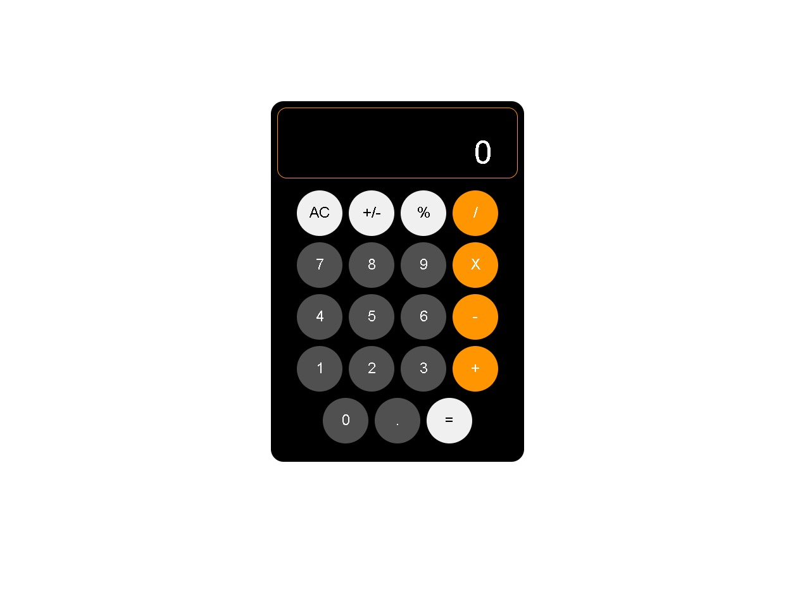

# React Calculator

    

Projeto construído utilizando as ferramentas do React

## 🛠 Tecnologias

- React
- Material UI

## Aplicações

- Hooks
- Imutabilidade
- Reutilização de componentes
- Material Components
